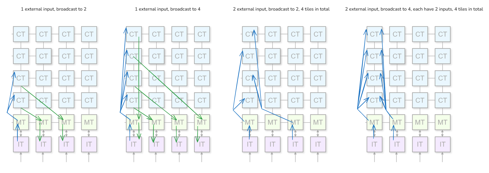

# Transfer Exp


broadcasting will have some sync overhead, but that won't be large as long as all dsts are doing identical computation (same computation latency). 

more NPU-main memory data movement-> more stalls (shared main memory)

## Exp1
```python
def test_single_input_matmul():
    Ty = bfloat16
    M = N = K = 64
    LyC = Layout("RS0")
    P = 32
    p = 2

    @df.region()
    def top():
        @df.kernel(mapping=[P])
        def core(A: Ty[M, K], C: Ty[M, N * P] @ LyC):
            B: Ty[K, N] = 1
            C[:, :] = allo.matmul(A, B)

    if Ty == int16:
        A = np.random.randint(0, 100, (M, K)).astype(np.int16)
        C = np.zeros((M, N * P)).astype(np.int16)
    if Ty == bfloat16:
        A = (np.random.random((M, K)) * 0.1).astype(np_bfloat16)
        C = np.zeros((M, N * P)).astype(np_bfloat16)

    groups = []
    for i in range(0, P, p):
        cores = []
        for j in range(p):
            cores.append(f"core_{i + j}")
        groups.append(tuple(cores))
    # os.environ["ENABLE_AGGRESSIVE_PORT_UTILIZATION_PATCH"] = "1"
    # os.environ["COALESCE_MORE"] = "1"
    # mod = df.build(
    #     top,
    #     target="aie",
    #     mapping_primitives=[
    #         ("bundle", groups),
    #     ],
    # )
    # mod(A, C)
    # del os.environ["ENABLE_AGGRESSIVE_PORT_UTILIZATION_PATCH"]
    # del os.environ["COALESCE_MORE"]

    allo.backend.aie._call_prj("top.prj", [Ty, Ty], 65536, [0], [1], A, C)
    print("PASSED!")
```
+ manual fix

## Exp2
```python
def test_single_input_matmul():
    Ty = bfloat16
    M = N = K = 64
    LyC = Layout("RS0")
    P = 64
    p = 4

    @df.region()
    def top():
        @df.kernel(mapping=[P])
        def core(A: Ty[M, K], C: Ty[M, N * P] @ LyC):
            B: Ty[K, N] = 1
            C[:, :] = allo.matmul(A, B)

    if Ty == int16:
        A = np.random.randint(0, 100, (M, K)).astype(np.int16)
        C = np.zeros((M, N * P)).astype(np.int16)
    if Ty == bfloat16:
        A = (np.random.random((M, K)) * 0.1).astype(np_bfloat16)
        C = np.zeros((M, N * P)).astype(np_bfloat16)

    groups = []
    for i in range(0, P, p):
        cores = []
        for j in range(p):
            cores.append(f"core_{i + j}")
        groups.append(tuple(cores))
    # os.environ["ENABLE_AGGRESSIVE_PORT_UTILIZATION_PATCH"] = "1"
    # os.environ["COALESCE_MORE"] = "1"
    # mod = df.build(
    #     top,
    #     target="aie",
    #     mapping_primitives=[
    #         ("bundle", groups),
    #     ],
    # )
    # mod(A, C)
    # del os.environ["ENABLE_AGGRESSIVE_PORT_UTILIZATION_PATCH"]
    # del os.environ["COALESCE_MORE"]

    allo.backend.aie._call_prj("top.prj", [Ty, Ty], 65536, [0], [1], A, C)
    print("PASSED!")
```
+ manual fix

## Exp3
```python
def test_matmul():
    Ty = bfloat16
    M = N = K = 64
    LyC = Layout("RS0")
    P = 32
    p = 2

    @df.region()
    def top():
        @df.kernel(mapping=[P])
        def core(A: Ty[M, K], C: Ty[M, N * P] @ LyC):
            B: Ty[K, N] = 1
            C[:, :] = allo.matmul(A, B)

        @df.kernel(mapping=[P])
        def cor(A_: Ty[M, K], C_: Ty[M, N * P] @ LyC):
            B: Ty[K, N] = 1
            C_[:, :] = allo.matmul(A_, B)

    if Ty == int16:
        A = np.random.randint(0, 100, (M, K)).astype(np.int16)
        C = np.zeros((M, N * P)).astype(np.int16)
        C_ = np.zeros((M, N * P)).astype(np.int16)
    if Ty == bfloat16:
        A = (np.random.random((M, K)) * 0.1).astype(np_bfloat16)
        C = np.zeros((M, N * P)).astype(np_bfloat16)
        C_ = np.zeros((M, N * P)).astype(np_bfloat16)

    groups, groups_ = [], []
    for i in range(0, P, p):
        cores, cores_ = [], []
        for j in range(p):
            cores.append(f"core_{i + j}")
            cores_.append(f"cor_{i + j}")
        groups.append(tuple(cores))
        groups_.append(tuple(cores_))

    # os.environ["ENABLE_AGGRESSIVE_PORT_UTILIZATION_PATCH"] = "1"
    # os.environ["COALESCE_MORE"] = "1"
    # mod = df.build(
    #     top,
    #     target="aie",
    #     mapping_primitives=[
    #         ("bundle", groups),
    #         ("bundle", groups_),
    #     ],
    # )
    # mod(A, C, A, C_)
    # del os.environ["ENABLE_AGGRESSIVE_PORT_UTILIZATION_PATCH"]
    # del os.environ["COALESCE_MORE"]

    allo.backend.aie._call_prj(
        "top.prj",
        [Ty, Ty, Ty, Ty],
        65536,
        [0, 2],
        [1, 3],
        A,
        C,
        A,
        C_,
    )

    # np.testing.assert_allclose(C[:, :N], A)
    print("PASSED!")

```
+ manual fix


## Exp4
```python
def test_single_matmul():
    Ty = bfloat16
    M = N = K = 64
    LyC = Layout("RS0")
    P = 32
    p = 4

    @df.region()
    def top():
        @df.kernel(mapping=[P])
        def core(A: Ty[M, K], B: Ty[K, N], C: Ty[M, N * P] @ LyC):
            C[:, :] = allo.matmul(A, B)

    if Ty == int16:
        A = np.random.randint(0, 100, (M, K)).astype(np.int16)
        B = np.random.randint(0, 100, (K, N)).astype(np.int16)
        C = np.zeros((M, N * P)).astype(np.int16)
    if Ty == bfloat16:
        A = (np.random.random((M, K)) * 0.1).astype(np_bfloat16)
        B = (np.random.random((K, N)) * 0.1).astype(np_bfloat16)
        C = np.zeros((M, N * P)).astype(np_bfloat16)

    groups = []
    for i in range(0, P, p):
        cores = []
        for j in range(p):
            cores.append(f"core_{i + j}")
        groups.append(tuple(cores))
    # os.environ["ENABLE_AGGRESSIVE_PORT_UTILIZATION_PATCH"] = "1"
    # os.environ["COALESCE_MORE"] = "1"
    # mod = df.build(
    #     top,
    #     project="single_matmul.prj",
    #     target="aie",
    #     mapping_primitives=[
    #         ("bundle", groups),
    #     ],
    # )
    # mod(A, B, C)
    # del os.environ["ENABLE_AGGRESSIVE_PORT_UTILIZATION_PATCH"]
    # del os.environ["COALESCE_MORE"]
    allo.backend.aie._call_prj("single_matmul.prj", [Ty, Ty, Ty], 65536, [0, 1], [2], A, B, C)
    print("PASSED!")
```

## Others
- [top.mlir](top.mlir): broadcast to 8 with only 2 output. (related to [this discussion](https://github.com/Xilinx/mlir-aie/issues/2735#issuecomment-3614515244))
    ```python
    def test_single_input_matmul():
        Ty = bfloat16
        M = N = K = 64
        LyC = Layout("RS0")
        P = 64
        p = 8

        @df.region()
        def top():
            @df.kernel(mapping=[P])
            def core(A: Ty[M, K], C: Ty[M, N * P] @ LyC):
                B: Ty[K, N] = 1
                C[:, :] = allo.matmul(A, B)

        if Ty == int16:
            A = np.random.randint(0, 100, (M, K)).astype(np.int16)
            C = np.zeros((M, N * P)).astype(np.int16)
        if Ty == bfloat16:
            A = (np.random.random((M, K)) * 0.1).astype(np_bfloat16)
            C = np.zeros((M, N * P)).astype(np_bfloat16)

        groups = []
        for i in range(0, P, p):
            cores = []
            for j in range(p):
                cores.append(f"core_{i + j}")
            groups.append(tuple(cores))
        os.environ["ENABLE_AGGRESSIVE_PORT_UTILIZATION_PATCH"] = "1"
        os.environ["COALESCE_MORE"] = "1"
        mod = df.build(
            top,
            target="aie",
            mapping_primitives=[
                ("bundle", groups),
            ],
        )
        mod(A, C)
        del os.environ["ENABLE_AGGRESSIVE_PORT_UTILIZATION_PATCH"]
        del os.environ["COALESCE_MORE"]

        allo.backend.aie._call_prj("top.prj", [Ty, Ty], 65536, [0], [1], A, C)
        print("PASSED!")
    ```